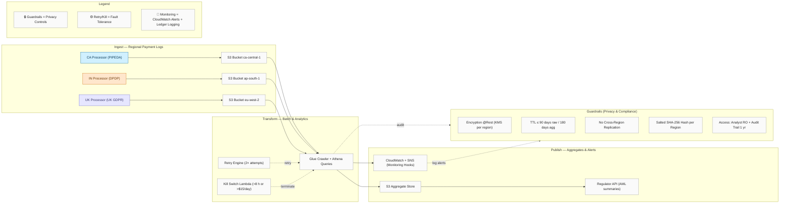

```mermaid
flowchart LR
  %% === Ingest ===
  subgraph Ingest["Ingest — Regional Payment Logs"]
    A_CA["CA Processor (PIPEDA)"]:::ca --> S_CA["S3 Bucket ca-central-1"]
    A_IN["IN Processor (DPDP)"]:::in --> S_IN["S3 Bucket ap-south-1"]
    A_UK["UK Processor (UK GDPR)"]:::uk --> S_UK["S3 Bucket eu-west-2"]
  end

  %% === Transform ===
  subgraph Transform["Transform — Batch & Analytics"]
    G["Glue Crawler + Athena Queries"]
    R["Retry Engine (2× attempts)"]
    K["Kill Switch Lambda (>8 h or >$15/day)"]
  end

  %% === Publish ===
  subgraph Publish["Publish — Aggregates & Alerts"]
    P1["S3 Aggregate Store"]
    P2["Regulator API (AML summaries)"]
    P3["CloudWatch + SNS (Monitoring Hooks)"]
  end

  %% === Flow ===
  S_CA --> G
  S_IN --> G
  S_UK --> G
  G --> P1 --> P2
  G --> P3
  R -. retry .-> G
  K -. terminate .-> G

  %% === Guardrails ===
  subgraph Guardrails["Guardrails (Privacy & Compliance)"]
    GR1["Encryption @Rest (KMS per region)"]
    GR2["TTL ≤ 90 days raw / 180 days agg"]
    GR3["No Cross-Region Replication"]
    GR4["Salted SHA-256 Hash per Region"]
    GR5["Access: Analyst RO + Audit Trail 1 yr"]
  end
  G -. audit .-> Guardrails
  P3 -. log alerts .-> Guardrails

  %% === Jurisdiction Boundaries ===
  classDef ca fill:#d0f0ff,stroke:#005f99,color:#00334d;
  classDef in fill:#ffe6cc,stroke:#cc6600,color:#663300;
  classDef uk fill:#e6e6ff,stroke:#6666cc,color:#333366;
  classDef default fill:#fafafa,stroke:#999,color:#222;

  %% Legend
  subgraph Legend["Legend"]
    L1["🔒 Guardrails = Privacy Controls"]
    L2["⚙️ Retry/Kill = Fault Tolerance"]
    L3["📡 Monitoring = CloudWatch Alerts + Ledger Logging"]
  end
```
